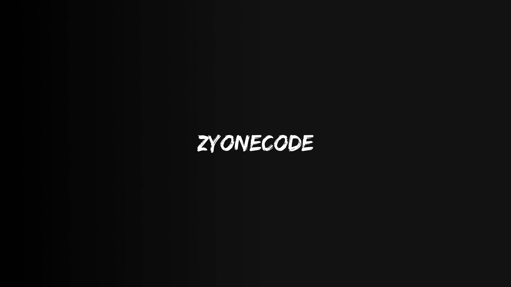

---

### 👋 Hey, I'm Ghazy

I am a full-stack developer with knowledge and skills in comprehensive software development, from frontend to backend. I have experience in developing attractive and responsive user interfaces for websites and applications.

### **Tools**

_Website Development_

   

_Mobile Development_

 

_Backend | Database_

     
